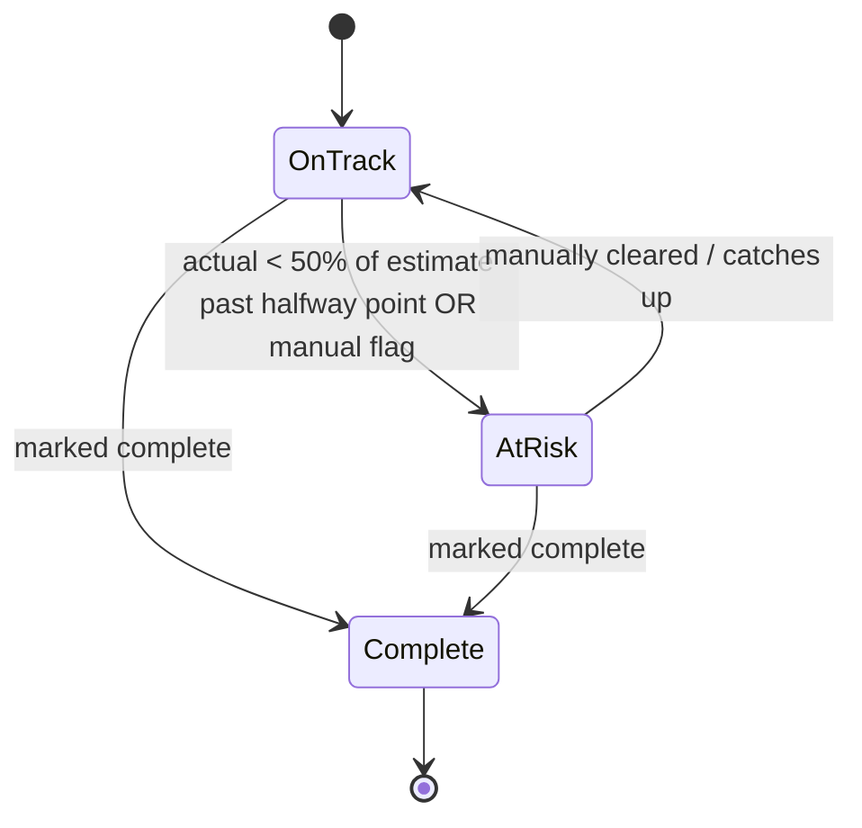

# Data Model: Benchmark Gap Tracker

## Entities

### Portfolio

| Field | Type | Required | Description |
| --- | --- | --- | --- |
| id | string | Yes | Stable slug, e.g. `procurement` |
| name | string | Yes | Display name, e.g. "Procurement" |
| objective | string | Yes | One-line objective/description |
| owner | string | Yes | Senior sponsor name |
| identifiedPotential | number | Yes | $ identified potential for the portfolio (fixed seed value) |

### Initiative

| Field | Type | Required | Description |
| --- | --- | --- | --- |
| id | string | Yes | Unique id (uuid or slug) |
| portfolioId | string | Yes | FK → Portfolio.id |
| name | string | Yes | Initiative name |
| businessCase | string | Yes | Short description of the business case |
| estimatedSavings | number | Yes | $ estimated cash savings |
| actualSavings | number | Yes | $ actual cash savings to date |
| status | 'OnTrack' \| 'AtRisk' \| 'Complete' | Yes | Manual status; `AtRisk` forces at-risk regardless of computed logic |
| owner | string | Yes | Accountable owner (may differ from portfolio owner) |
| targetDate | string (ISO date) | Yes | Target completion date |
| startDate | string (ISO date) | Yes | Used to compute "halfway point to target date"; defaults to initiative creation date if not tracked separately |

### BenchmarkSettings

| Field | Type | Required | Description |
| --- | --- | --- | --- |
| overallTarget | number | Yes | Total $ benchmark commitment |
| yearlyMilestones | `{ year: number; target: number }[]` | Yes | Fixed benchmark ambition per year (top chart line) |
| momentumTrajectory | `{ year: number; target: number }[]` | Yes | Continuous-improvement / BAU baseline with no transformation initiatives, per year (bottom chart line) |

## Validation Rules

- `Initiative.estimatedSavings >= 0`, `Initiative.actualSavings >= 0`
- `Initiative.targetDate` must be a valid date; `startDate <= targetDate`
- `Initiative.portfolioId` must reference an existing Portfolio
- `BenchmarkSettings.yearlyMilestones` years must be unique and sorted ascending

## Relationships

- One `Portfolio` has many `Initiative` (1:N via `portfolioId`)
- `BenchmarkSettings` is a singleton, independent of Portfolio/Initiative

## Derived / Computed (not stored)

- **isInitiativeAtRisk**: `status === 'AtRisk'` OR (`today` is past the
  midpoint between `startDate` and `targetDate` AND `actualSavings < 0.5 *
  estimatedSavings`)
- **isPortfolioAtRisk**: true if any of its initiatives is at risk
- **Portfolio rollups**: initiative count, % on track vs. at risk, sum of
  estimated/actual savings
- **Gap-to-goal series**: per year through 2030, `{ year, benchmarkTarget,
  currentTrajectory, momentumCase }` — `benchmarkTarget` from
  `BenchmarkSettings.yearlyMilestones`, `momentumCase` from
  `BenchmarkSettings.momentumTrajectory`, and `currentTrajectory` = momentum
  case + sum of initiative actual (past years) / estimated (future years)
  savings

## State Transitions

## Entity-to-UserStory Mapping

| Entity | User Stories |
| --- | --- |
| Portfolio | Gap-to-Goal Visibility, Portfolio Drill-Down, Filter by Owner |
| Initiative | Spot What's At Risk, Manage Initiatives, Filter by Owner |
| BenchmarkSettings | Gap-to-Goal Visibility, Set Targets |

## Database Considerations

No database — data lives in browser `localStorage` as a single JSON blob:
`{ portfolios, initiatives, settings, schemaVersion }`. On load, validate
`schemaVersion`; if mismatched or parse fails, fall back to seed data.
