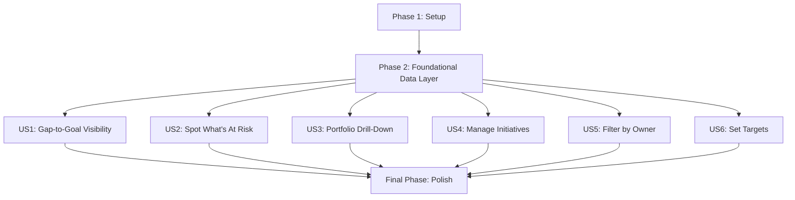

# Tasks: Benchmark Gap Tracker

## Overview

Total tasks: 24. User stories: 6 (3×P1, 2×P2, 1×P3). Parallel opportunities
marked `[P]` within each phase.

## Dependencies

## Phase 1: Setup

**Goal**: Scaffold project so pages/routes can be built.

- [ ] T001 Scaffold Vite + React + TS app at repo root (`package.json`,
      `vite.config.ts`, `tsconfig.json`, `index.html`, `src/main.tsx`)
- [ ] T002 Install `react-router-dom`, `recharts`; add `vitest`,
      `@testing-library/react` as dev deps
- [ ] T003 [P] Create `src/domain/types.ts` with `Portfolio`, `Initiative`,
      `BenchmarkSettings`, `Status` types
- [ ] T004 [P] Create `src/styles/global.css` with neutral palette,
      typography, layout base
- [ ] T005 Create `src/App.tsx` with React Router routes for all 6 pages
      (placeholders)

**Verification**: `npm run dev` shows navigable shell app with 6 empty pages.

## Phase 2: Foundational (Data Layer)

**Goal**: Seed data + store + persistence, blocking all user stories.

- [ ] T006 Create `src/data/seed.ts` — 5 portfolios (Procurement $2BN, Lost
      Production Opportunity $4BN, Asset Retirement $2BN, Capital Project
      Efficiency $3BN, Tech Scaling $3BN) each with 2-3 realistic initiatives
- [ ] T007 Create `src/state/store.tsx` — `AppStoreProvider`, `useAppStore()`
      hook, load/save `localStorage` with `schemaVersion`, fallback to seed on
      mismatch/parse failure
- [ ] T008 Add CRUD actions to store: `addInitiative`, `updateInitiative`,
      `updateSettings`
- [ ] T009 Wrap `src/App.tsx` root in `AppStoreProvider`

**Verification**: Store initializes from seed; edits persist across reload
(manual refresh test).

## Phase 3: US1 — Gap-to-Goal Visibility (P1)

**Independent Test Criteria**: Landing page renders chart + stats matching
seed data and settings without any other page implemented.

- [ ] T010 [US1] Create `src/domain/gapToGoal.ts` — yearly series builder
      (target cumulative vs. actual+projected cumulative through 2030)
- [ ] T011 [US1] Create `src/pages/LandingPage.tsx` — Recharts line/area chart
      from `gapToGoal.ts` + summary stat cards (total identified, total
      delivered, at-risk count)
- [ ] T012 [P] [US1] Unit test `src/domain/gapToGoal.test.ts` for series
      correctness

**Verification**: Landing page checkable acceptance criteria in spec.md pass.

## Phase 4: US2 — Spot What's At Risk (P1)

**Independent Test Criteria**: Needs Attention page lists correct at-risk
items sorted by $ at stake using seed data.

- [ ] T013 [US2] Create `src/domain/risk.ts` — `isInitiativeAtRisk`,
      `isPortfolioAtRisk`
- [ ] T014 [P] [US2] Unit test `src/domain/risk.test.ts` covering boundary
      conditions (exactly 50%, before/after halfway point, manual override)
- [ ] T015 [US2] Create `src/pages/NeedsAttentionPage.tsx` — at-risk list
      sorted by $ at stake descending, with reason shown

**Verification**: Needs Attention acceptance criteria in spec.md pass.

## Phase 5: US3 — Portfolio Drill-Down (P1)

**Independent Test Criteria**: Portfolios page shows all 5 with rollups;
clicking one shows its initiatives.

- [ ] T016 [US3] Create `src/domain/rollups.ts` — per-portfolio rollups
      (identified potential, initiative count, % on track vs. at risk)
- [ ] T017 [US3] Create `src/pages/PortfoliosPage.tsx` — list of 5 portfolios
      with rollups
- [ ] T018 [US3] Create `src/pages/PortfolioDetailPage.tsx` — initiatives for
      a selected portfolio (route `/portfolios/:id`)

**Verification**: Portfolio acceptance criteria in spec.md pass.

## Phase 6: US4 — Manage Initiatives (P2)

**Independent Test Criteria**: Form creates/edits an initiative and rollups/
at-risk state update immediately.

- [ ] T019 [US4] Create `src/pages/InitiativeFormPage.tsx` — create/edit form
      (name, business case, estimated/actual savings, status, owner, target
      date, portfolio dropdown) with field validation, routes
      `/initiatives/new` and `/initiatives/:id/edit`

**Verification**: Manage Initiatives acceptance criteria in spec.md pass.

## Phase 7: US5 — Filter by Owner (P2)

**Independent Test Criteria**: Owner filter narrows Portfolios and Needs
Attention views correctly.

- [ ] T020 [US5] Create shared owner-filter selector/hook in
      `src/domain/rollups.ts` (or new `src/domain/filters.ts`)
- [ ] T021 [US5] Wire owner filter control into `PortfoliosPage.tsx` and
      `NeedsAttentionPage.tsx`

**Verification**: Filter acceptance criteria in spec.md pass.

## Phase 8: US6 — Set Targets (P3)

**Independent Test Criteria**: Settings page edits propagate to the
gap-to-goal chart immediately.

- [ ] T022 [US6] Create `src/pages/SettingsPage.tsx` — edit overall benchmark
      target and yearly milestones through 2030, calling
      `store.updateSettings`

**Verification**: Set Targets acceptance criteria in spec.md pass.

## Final Phase: Polish

**Goal**: Cross-cutting consistency and delivery readiness.

- [ ] T023 [P] Apply consistent neutral styling/layout across all pages;
      handle empty/loading states
- [ ] T024 Add `README.md` with run instructions; re-verify every spec.md
      acceptance criterion end-to-end

**Verification**: `npm run build` succeeds; full manual walkthrough of
spec.md acceptance criteria passes.

## Parallel Execution Guide

- Phase 1: T003, T004 can run in parallel after T001/T002
- Phase 3–8: each user-story phase is independent of the others once Phase 2
  is done — can be built in parallel by different contributors
- T012, T014 (unit tests) can run parallel to their sibling page tasks once
  the domain module they test exists

## Implementation Strategy

1. **MVP first**: Phases 1–2, then US1 + US2 (core value: see the gap, see
   what's at risk) using seed data only.
2. **Incremental delivery**: Add US3 (drill-down), then US4 (editing) so the
   tool becomes usable end-to-end.
3. **Then**: US5 (filtering) and US6 (settings) round out the global features.
4. **Polish last**: styling consistency, docs, final acceptance pass.

## Coverage Check

- Plan phases covered: 5/5 (Setup, Data Layer, Business Logic, UI/Pages,
  Polish → mapped to Phases 1, 2, 3–8, Final)
- User stories covered: 6/6
- Functional requirements covered: FR-1..FR-9 → 9/9 (see plan.md Spec
  Traceability)
- Data model entities covered: Portfolio (T006,T017,T018), Initiative
  (T006,T013,T019), BenchmarkSettings (T006,T010,T022) → 3/3
